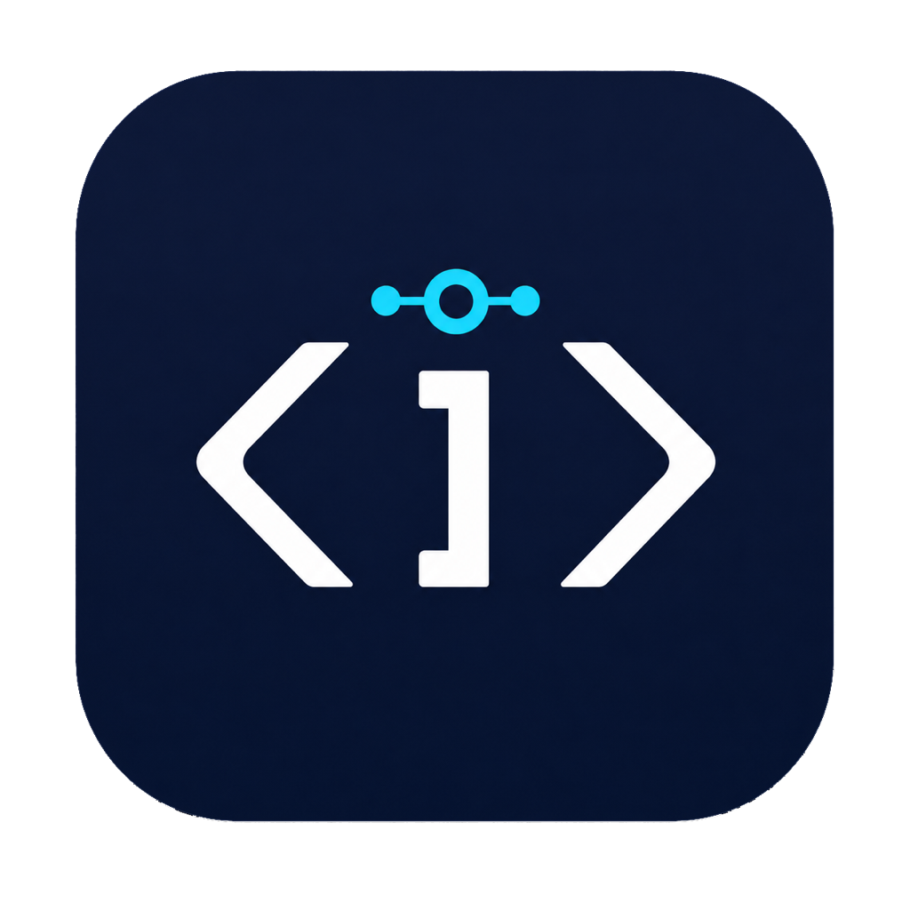

# iCoding Client



iCoding Client 是运行在用户电脑上的云端智能体客户端。它登录 iCoding 云端、注册当前设备、通过 WebSocket 接收任务，并在本地权限策略允许的范围内提供文件访问、目录搜索、命令执行和系统信息能力。

项目同时提供：

- macOS、Windows 桌面应用：包含登录、连接状态、服务地址和本地权限策略界面。
- Linux 及其他环境的 CLI/后台服务模式。
- 中英文界面与 CLI：默认英文，本地语言为中文时自动显示中文。

默认服务地址：

- API：`https://apilite.icoding.ink`
- WebSocket：`wss://apilite.icoding.ink/api/v1/agent/ws`
- WEBUI(一下是几个现成的示例，你也可以添加其他镜像站)：
  - `https://gpt.0101.run`
  - `https://link.cv58.xyz`
## 主要能力

- 邮箱或手机号验证码登录。
- 自动生成并注册设备 ID。
- WebSocket 长连接、心跳和断线重连。
- 浏览目录、读取文件、写入文件、创建目录、移动、删除和搜索。
- 在允许目录内执行命令，并限制超时和输出大小。
- 配置允许目录、阻止目录和命令执行总开关。
- 本地保存登录凭证，Unix 系统将凭证文件权限限制为 `0600`。
- 失败响应包含具体错误码、相关路径和底层原因。
- macOS/Windows 开机自启与托盘菜单。

## 桌面应用

macOS 和 Windows 默认启动桌面界面：

```bash
cargo run -- desktop
```

直接运行且不指定子命令时，macOS/Windows 也会进入桌面模式：

```bash
cargo run
```

### 界面说明

左侧状态栏显示：

- **账号**：当前登录邮箱、手机号或昵称。
- **设备**：本机生成的设备 ID。
- **Agent**：云端任务连接是否正在运行。
- **自启**：是否已开启登录后自动启动。
- **命令权限**：当前是否允许执行命令。
- **磁盘权限**：macOS 完整磁盘访问授权状态。

未登录时，主区域显示验证码登录页。可以选择邮箱或手机号，发送验证码后完成登录。

登录后，主区域包含：

- **服务地址**：修改 API 与 WebSocket 地址。
- **连接控制**：保存服务地址、启动连接或退出登录。
- **启动权限**：macOS 未授予完整磁盘访问时显示引导入口。
- **权限策略**：配置允许访问的目录，以及是否允许执行命令。
- **最近状态**：显示当前客户端、用户、策略和权限状态的 JSON 信息。

表单中的未保存内容不会被定时状态刷新覆盖。保存期间如果继续编辑，新内容会保留并提示仍未保存。

## macOS：首次启动必须授予完整磁盘访问

macOS 版本会在 Agent 启动前检查“完整磁盘访问”。没有授权时，客户端不会连接任务服务，也不会在任务执行到一半时再申请权限。

首次启动步骤：

1. 启动 iCoding Client。
2. 客户端会自动打开 **系统设置 → 隐私与安全性 → 完整磁盘访问**。
3. 将 **iCoding Client** 加入列表并开启权限。
4. 完全退出应用，然后重新启动。
5. 确认界面左侧“磁盘权限”显示为“已授权”。

如果使用 `cargo run` 开发调试，macOS 可能将权限归属到启动程序的 Terminal 或 IDE；此时需要为对应的 Terminal/IDE 授权。正式安装后应为 `iCoding Client.app` 授权。

> macOS 不允许应用通过代码静默取得完整磁盘访问，最终授权必须由当前用户在系统设置中确认。

完整磁盘访问是 macOS 系统权限，不会绕过客户端自己的路径策略。文件和命令仍只能访问 `allowed_roots` 内的路径，`.ssh`、`.gnupg` 和 `Library/Keychains` 等目录默认阻止。

## CLI 使用指南

### 语言

CLI 默认使用英文；`LC_ALL`、`LC_MESSAGES` 或 `LANG` 为 `zh*` 时自动使用中文。也可以显式覆盖：

```bash
ICODING_LANG=zh-CN icoding-client --help
ICODING_LANG=en icoding-client --help
```

以下示例假设已经将 release 可执行文件加入 `PATH`。开发时可以将 `icoding-client` 替换成 `cargo run --`。

### 全局语法

```text
icoding-client [OPTIONS] [COMMAND]
```

全局选项：

| 选项 | 说明 |
| --- | --- |
| `--api-base-url <URL>` | 本次运行覆盖 API 地址，也可使用 `ICODING_API_BASE_URL`。 |
| `--ws-url <URL>` | 本次运行覆盖 WebSocket 地址，也可使用 `ICODING_WS_URL`。 |
| `--save-server` | 将命令行传入的服务地址写入本地配置。 |
| `-h, --help` | 显示帮助。 |

保存新的默认服务器地址：

```bash
icoding-client \
  --api-base-url https://api.example.org \
  --ws-url wss://api.example.org/api/v1/agent/ws \
  --save-server \
  config-path
```

### 命令总览

| 命令 | 用途 |
| --- | --- |
| `desktop` | 启动桌面应用。 |
| `config-path` | 输出配置、会话、Token 和日志路径。 |
| `whoami` | 请求服务端并显示当前登录用户。 |
| `send-code` | 向邮箱或手机号发送登录验证码。 |
| `verify-code` | 验证登录码并将登录会话保存到本地。 |
| `logout` | 删除本地登录会话和 Token。 |
| `policy` | 查看或修改本地权限策略。 |
| `register-device` | 使用当前登录会话注册设备。 |
| `serve` | 在前台运行 Agent WebSocket 服务。 |
| `fs-list` | 列出目录。 |
| `fs-read` | 读取文本文件。 |
| `exec` | 在允许目录中执行命令。 |

### 登录与账号

发送邮箱验证码：

```bash
icoding-client send-code --email user@example.com
```

发送手机验证码：

```bash
icoding-client send-code --mobile 13800138000
```

验证邮箱登录码：

```bash
icoding-client verify-code --email user@example.com --code 123456
```

验证手机登录码：

```bash
icoding-client verify-code --mobile 13800138000 --code 123456
```

`--email` 与 `--mobile` 必须二选一。登录成功后，Token 写入独立的本地凭证文件，用户信息写入会话缓存。

查看当前用户：

```bash
icoding-client whoami
```

退出登录：

```bash
icoding-client logout
```

### 查看本地文件位置

```bash
icoding-client config-path
```

输出示例：

```json
{
  "config_file": ".../config.toml",
  "session_file": ".../session.json",
  "token_file": ".../session.token",
  "log_dir": ".../logs"
}
```

可通过 `ICODING_CLIENT_HOME` 将所有文件放到指定根目录：

```bash
ICODING_CLIENT_HOME=/opt/icoding-client icoding-client config-path
```

此时目录结构为：

```text
/opt/icoding-client/
├── config/config.toml
├── data/session.json
├── data/session.token
└── logs/
```

### 权限策略

查看当前策略：

```bash
icoding-client policy show
```

替换全部允许目录：

```bash
icoding-client policy set-roots ~/Projects ~/Work
```

添加一个允许目录：

```bash
icoding-client policy add-root ~/Projects/demo
```

移除一个允许目录：

```bash
icoding-client policy remove-root ~/Projects/demo
```

允许或禁止命令执行：

```bash
icoding-client policy shell --enable
icoding-client policy shell --disable
```

命令执行默认允许。命令执行和删除操作不进行逐次确认，但仍必须通过允许目录、阻止目录和路径规范化检查。

默认策略限制：

- 单次文件读取上限：1 MiB。
- 单次文件写入上限：1 MiB。
- 命令输出上限：10 MiB。
- 命令超时上限：300 秒。
- 默认阻止 `.ssh`、`.gnupg` 和 macOS `Library/Keychains`。

### 文件命令

列出目录：

```bash
icoding-client fs-list ~/Projects/demo
```

递归列出目录：

```bash
icoding-client fs-list ~/Projects/demo --recursive
```

读取 UTF-8 文本文件：

```bash
icoding-client fs-read ~/Projects/demo/README.md
```

这些 CLI 命令是便于调试的入口。WebSocket 任务还支持：

- `fs.stat`
- `fs.list`
- `fs.read`
- `fs.write`
- `fs.mkdir`
- `fs.move`
- `fs.delete`
- `fs.search`

所有路径必须位于允许目录中。目录不存在、权限不足或路径被策略阻止时，错误会包含具体路径与底层失败原因。

### 执行命令

```bash
icoding-client exec --cwd ~/Projects/demo cargo test
```

`--cwd` 是必填项，并且必须是允许目录内已经存在的目录。其后的所有参数会拼接成一条命令，通过系统默认 shell 执行。

如果被执行命令自身包含以 `-` 开头的选项，请使用 `--` 分隔客户端参数和命令参数：

```bash
icoding-client exec --cwd ~/Projects/demo -- cargo test --release
```

结果以 JSON 输出：

```json
{
  "command": "cargo test",
  "cwd": "/Users/alice/Projects/demo",
  "exit_code": 0,
  "success": true,
  "stdout": "...",
  "stderr": "",
  "stdout_truncated": false,
  "stderr_truncated": false
}
```

非零退出码会通过 `success: false` 和 `stderr` 返回；进程无法启动或超时则作为命令失败返回具体原因。

### 注册设备

```bash
icoding-client register-device
```

该命令需要已经登录。客户端会上报设备 ID、系统信息、能力列表、允许目录和命令权限，并输出服务端返回的设备信息。

### 后台服务模式

```bash
icoding-client serve
```

启动顺序：

1. 加载本地登录会话。
2. 向 API 注册设备。
3. 使用服务端返回或本地配置的 WebSocket 地址连接云端。
4. 接收任务并回传结果。
5. 连接断开后指数退避重连，最长等待 60 秒。

跳过 HTTP 设备注册，直接使用本地 WebSocket 配置：

```bash
icoding-client serve --skip-device-register
```

Linux 在没有显式子命令时默认进入 `serve` 模式；macOS/Windows 默认进入 `desktop` 模式。

## 配置文件

配置使用 TOML 格式。实际路径请以 `icoding-client config-path` 输出为准。

示例：

```toml
[server]
api_base_url = "https://apilite.icoding.ink"
ws_url = "wss://apilite.icoding.ink/api/v1/agent/ws"

[client]
device_id = "dev_xxxxxxxxxxxxxxxxxxxxxxxxxxxxxxxx"
auto_start = true
start_minimized = true
log_level = "info"

[policy]
allowed_roots = ["/Users/alice/Projects"]
blocked_paths = [
  "/Users/alice/.ssh",
  "/Users/alice/.gnupg",
  "/Users/alice/Library/Keychains",
]
shell_exec_enabled = true
max_file_read_bytes = 1048576
max_file_write_bytes = 1048576
max_command_output_bytes = 10485760
default_command_timeout_seconds = 300
```

## 环境变量

| 环境变量 | 说明 |
| --- | --- |
| `ICODING_CLIENT_HOME` | 覆盖配置、数据和日志根目录。 |
| `ICODING_API_BASE_URL` | 覆盖 API 地址。 |
| `ICODING_WS_URL` | 覆盖 WebSocket 地址。 |
| `ICODING_LANG` | 强制 CLI 语言，例如 `en` 或 `zh-CN`。 |
| `RUST_LOG` | 控制日志过滤级别，例如 `icoding_client=debug`. |

## 构建与测试

需要稳定版 Rust 工具链。

运行测试：

```bash
cargo test --locked
```

严格静态检查：

```bash
cargo clippy --all-targets --locked -- -D warnings
```

构建 release 可执行文件：

```bash
cargo build --release --locked
```

本地构建 macOS/Windows 桌面安装包：

```bash
cargo install tauri-cli --version "^2" --locked
cargo tauri build
```

仓库内的 `.github/workflows/build.yml` 支持手动触发或推送 `v*` 标签后构建：

- macOS Apple Silicon
- macOS Intel
- Windows x64
- Linux x64

构建结果会上传到对应 GitHub Actions 运行的 Artifacts。当前桌面产物未配置代码签名。

## 常见问题

### 启动日志出现 `not logged in`

未登录时客户端无法自动启动 Agent。这不会导致桌面窗口崩溃，完成验证码登录后即可连接。

### `path is outside allowed roots`

目标路径不在 `policy.allowed_roots` 内。通过桌面权限策略或 `policy add-root` 添加需要访问的目录。

### `path is blocked by policy`

目标路径命中了 `blocked_paths`。完整磁盘访问不会绕过该限制。

### `shell execution is disabled by local policy`

通过桌面界面勾选“允许执行命令”，或运行：

```bash
icoding-client policy shell --enable
```

### macOS 一直显示磁盘权限待授权

确认授权对象与实际启动方式一致：正式应用应授权 `iCoding Client.app`，开发模式应检查 Terminal 或 IDE。修改权限后完全退出并重新启动应用。

### WebSocket 无法连接

检查：

1. 是否已经登录。
2. API 与 WebSocket 地址是否正确。
3. 网络是否允许访问服务地址。
4. 设备注册接口是否返回了新的 `ws_url` 或短期连接 Token。

## 协议文档

- [云端 API 要求](Cloud_API_Requirements.md)
- [WebSocket 协议](WebSocket_Protocol.md)
- [需求与规划](Requirements_and_Planning.md)
